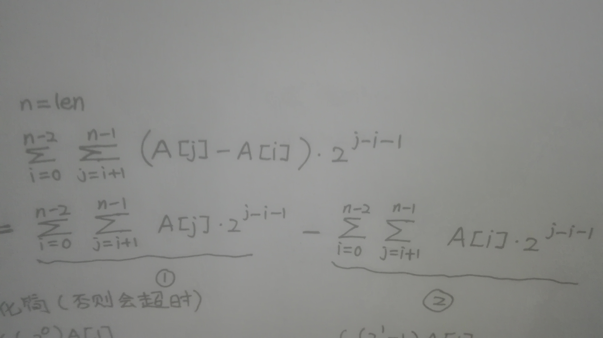
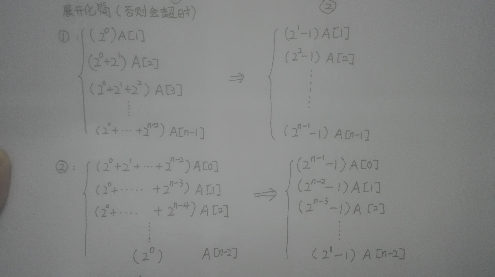
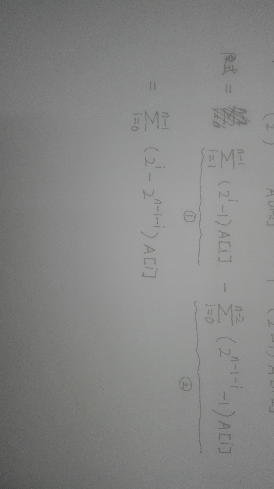

化简：

<code>
<pre>
#include <algorithm>
class Solution {
public:
    /*
    排序以后，已知最大值A[j]和最小值A[i]
    求这个width有多少种可能
    */
    int sumSubseqWidths(vector<int>& A) {
        // 先排序,从小到大
        sort(A.begin(), A.end());
        int i, j;
        long width;
        long sumWidth = 0;
        long mo = pow(10,9)+7;
        int len = A.size();
        // 数据太大
        // 2^num先取模
        long* myPow = new long[len];
        myPow[0] = 1;   //2^0 = 1
        for (i = 1; i < len; i++) {
            myPow[i] = myPow[i - 1] * 2 % mo;
        }
        /*
        for (i = 0; i < len - 1; i++) {
            for (j = i + 1; j < len; j++) {
                // 当前width
                width = A[j] - A[i];
                // 有多少种组合是A[i]最小，A[j]最大 ->2^num种
                int num = j - i - 1;
                sumWidth += (width * myPow[num]) % mo;
                sumWidth = sumWidth % mo;
            }
        }
        */
        // 化简
        for (i = 0; i < len; i++) {
            long temp = (myPow[i] - myPow[len - 1 - i]) * A[i] % mo;
            sumWidth = (sumWidth + temp) % mo;
        }
        
        return (int)sumWidth;
    }
};
</pre>
</code>
